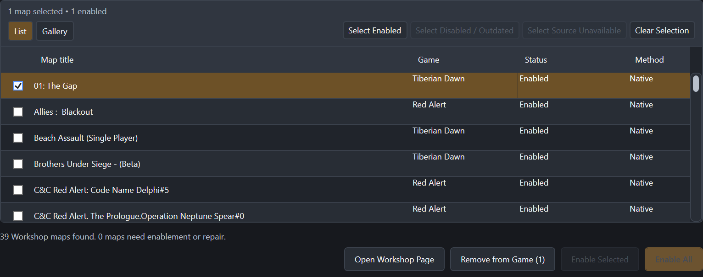
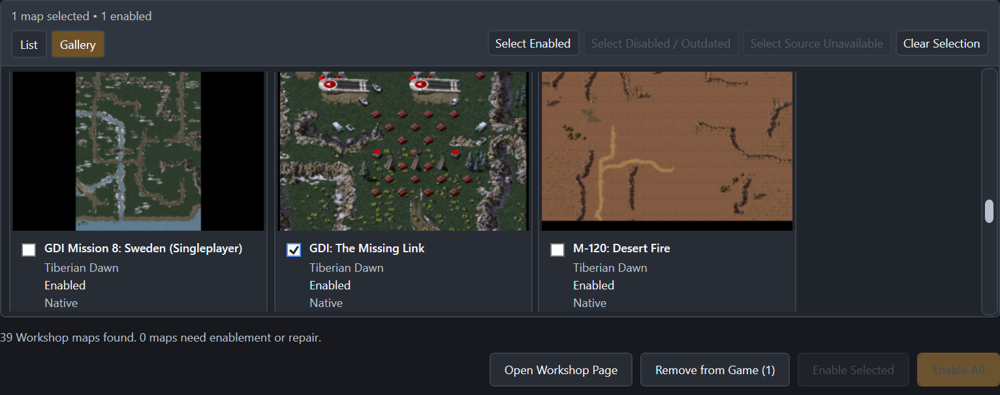
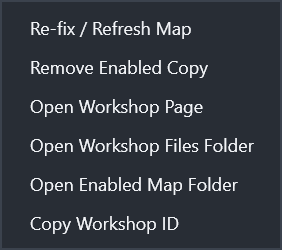

# C&C Remastered Steam Workshop Map Fixer

C&C Remastered Steam Workshop Map Fixer is a Windows utility for Steam users of *Command & Conquer Remastered Collection*. Steam Workshop subscriptions can download map packages successfully while C&C still fails to make those maps available in-game; the Fixer bridges that missing step by enabling maps Steam has already downloaded.

## Download

Official releases are available from the [GitHub Releases page](https://github.com/TerraEx/CNC_Remastered_Steam_Workshop_Map_Fixer/releases).

- **Self-contained win-x64** is recommended for most users and includes the required .NET runtime.
- **Framework-dependent win-x64** is for users who already have the x64 .NET 10 Desktop Runtime installed.

The executable is unsigned, so Windows SmartScreen may display a warning. Only downloads from the official GitHub Releases page are considered official releases from the author. Redistribution of unmodified copies is permitted, but the author cannot guarantee redistributed copies because their integrity cannot be verified.

## What it does

- Discovers C&C Remastered Workshop maps already downloaded by Steam, including maps from Workshop collections.
- Supports both Tiberian Dawn and Red Alert maps.
- Enables downloaded maps without making you find and download them again through C&C's in-game User Maps browser.
- Provides List and Gallery views with map previews.
- Handles Workshop updates and supports safe, attributable removal from the game.
- Offers the recommended **Native C&C Cache** method and an advanced **Direct Local Install** method.

## Screenshots

*The List view makes it easy to see and manage downloaded Workshop maps.*

*The Gallery view provides map previews while retaining the same selection workflow.*

*The context menu provides focused maintenance and navigation actions for a map.*

## Quick start

1. Subscribe to maps or a collection in Steam Workshop.
2. Let Steam finish downloading them.
3. Download and extract the Fixer.
4. Run it.
5. Click **Enable All**, or select maps and choose **Enable Selected**.
6. Launch C&C Remastered.

## Installation methods

### Native C&C Cache — Recommended

Native C&C Cache places the untouched Workshop package into C&C's native UGC cache and lets C&C unpack and manage it. This is the recommended method for normal use and gives C&C the game-side state it expects for a downloaded map.

### Direct Local Install — Advanced

Direct Local Install places supported map files directly into C&C's local map folders. The map can be installed and playable even though the in-game User Maps browser may still display **Download**, because that browser does not have C&C's native cached-package association for a direct installation.

### Known Red Alert custom mission restart issue

Red Alert Remastered has an intermittent bug when restarting or replaying custom single-player missions. Occasionally, the mission does not initialise correctly after a restart.

Symptoms observed during testing include:

- the opening custom-mission briefing not appearing;
- mission triggers or scripted events failing to run;
- mission timers failing to initialise;
- units starting in an incorrect state.

This was reproduced independently of the Workshop Fixer on a clean installation of C&C Remastered, with default settings, no mods active, and without manually subscribing through Steam Workshop; the maps were downloaded entirely through the game's own in-game map browser. It was also reproduced across multiple Red Alert custom missions.

If this happens, restart the mission again or return to the menu and launch it normally. A subsequent restart may also initialise correctly.

This issue has been observed in **Red Alert** custom missions during testing; it has **not been reproduced in Tiberian Dawn**.

**Example video:** [Red Alert custom mission restart bug demonstration](https://youtu.be/6Pd4T7qVUNk)

## Why I made this

I first encountered this problem around 2020/2021. Steam Workshop subscriptions downloaded custom maps, but that did not make them conveniently available in-game. I nearly wrote a small utility then, assumed somebody else eventually would, and returned years later to essentially the same problem.

After publishing my own Tiberian Dawn missions, I heard from players who had subscribed through Steam Workshop but could not find the missions in-game. I also found that some maps which had previously been visible through C&C's in-game browser were no longer discoverable there even though their Steam Workshop pages still existed.

The Steam Workshop should be usable as the catalogue. The Fixer lets players subscribe to individual maps or entire collections, let Steam download them, and then enable those downloads without searching for the same content again inside the game. That makes Workshop collections genuinely useful: subscribe to a collection, run the Fixer, and click **Enable All**.

You find something you want to play. You subscribe to it. You run the app, click **Enable All**, then launch the game. It should be there.

## Safety and privacy

- Workshop source packages are treated as read-only.
- The Fixer does not subscribe or unsubscribe Workshop items and does not modify Steam Workshop manifests.
- It does not silently overwrite modified or unowned local files.
- It collects no telemetry.
- Steam's public metadata endpoint is used to resolve Workshop metadata; no Steam login or API key is required.

## Distribution and licensing

The application is distributed as closed-source software. Its source code is not currently publicly distributed. Unmodified application and release packages may be redistributed, but only the official [GitHub Releases page](https://github.com/TerraEx/CNC_Remastered_Steam_Workshop_Map_Fixer/releases) provides builds whose integrity is guaranteed by the author. See [LICENSE](LICENSE) for the application distribution terms. Third-party and runtime licences and notices are included in each release package.

The application includes work informed by the Iron Curtain [`cnc-formats` MEG implementation](https://github.com/iron-curtain-engine/cnc-formats/tree/77da596ed72a1201740e054855bf2ff60640bfa9/src/meg), used under its MIT licence option, and [Petrolution's public Petroglyph MEG format documentation](https://modtools.petrolution.net/docs/MegFileFormat). Those third-party terms do not make this application MIT-licensed.

## Disclaimer

This is an unofficial community utility and is not affiliated with or endorsed by Electronic Arts, Petroglyph, or Valve.
